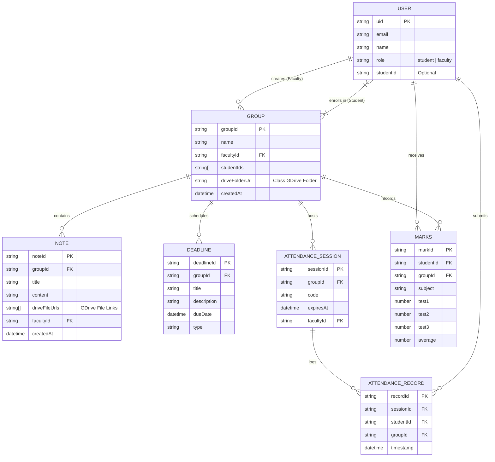
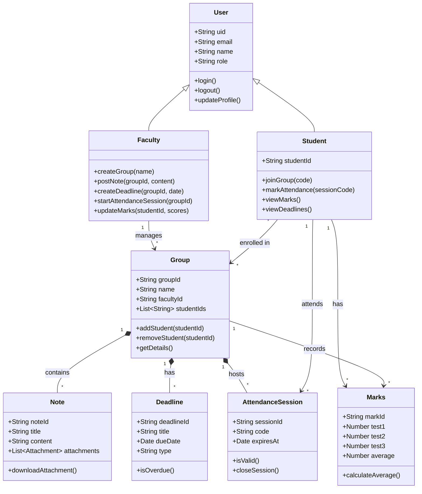
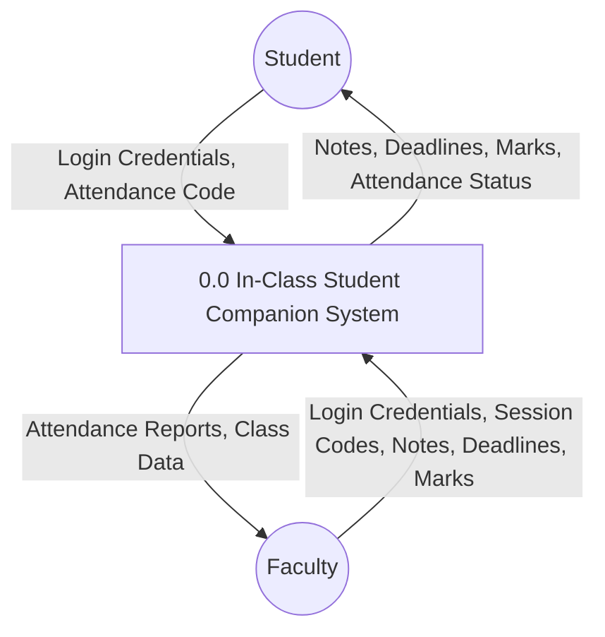
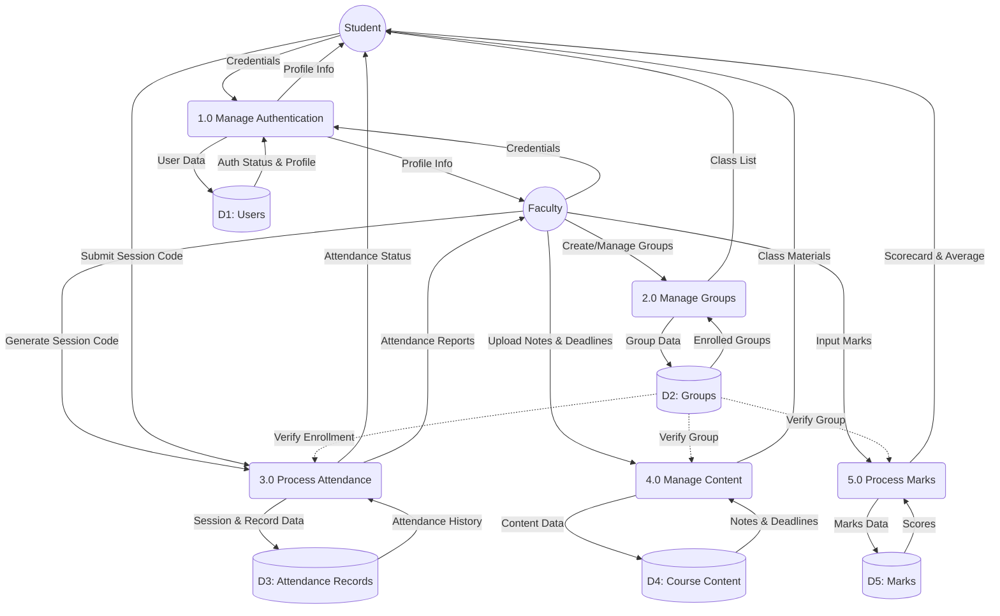
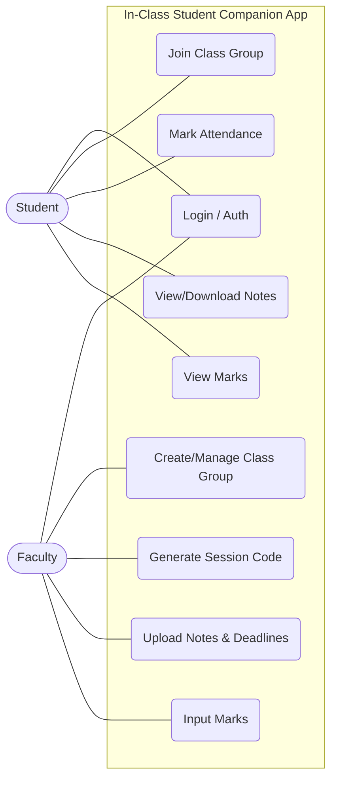
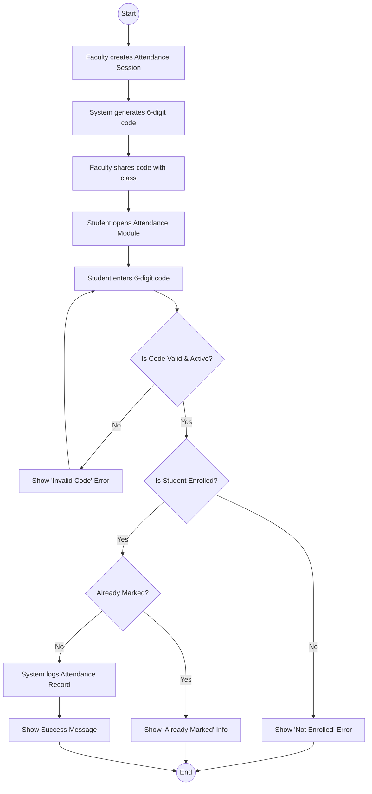

# System Design Documentation
## Project: In-Class Student Companion App

**Version:** 1.0
**Date:** March 8, 2026

---

## 1. System Architecture

The **In-Class** app follows a serverless architecture using **Firebase** as the backend-as-a-service (BaaS) and **React Native (via Capacitor)** for the frontend client.

### 1.1 High-Level Architecture Diagram
```mermaid
graph TD
    Client[Mobile App (React + Capacitor)]
    Auth[Firebase Authentication]
    DB[Firestore Database]
    Storage[Firebase Storage]
    
    Client -->|Authenticates| Auth
    Client -->|Reads/Writes Data| DB
    Client -->|Uploads/Downloads Files| Storage
    
    subgraph Backend Services
        Auth
        DB
        Storage
    end
```

---

## 2. Data Design

### 2.1 Entity Relationship Diagram (ERD)

The following diagram illustrates the relationships between the core entities in the Firestore database.



### 2.2 Cardinality and Relationships

*   **USER (Faculty) `1 : N` GROUP**: A single faculty member can create and manage multiple groups (classes), but each group is created by exactly one faculty member.
*   **USER (Student) `M : N` GROUP**: A student can enroll in multiple groups, and each group can contain multiple students. *(Note: In Firestore, this is modeled using an array of `studentIds` inside the Group document).*
*   **GROUP `1 : N` NOTE**: A group can contain multiple notes or announcements, but a specific note belongs to exactly one group.
*   **GROUP `1 : N` DEADLINE**: A group can have multiple scheduled deadlines (assignments/exams), but each deadline belongs to exactly one group.
*   **GROUP `1 : N` ATTENDANCE_SESSION**: A group can host multiple attendance sessions over the semester, but each session is tied to exactly one group.
*   **ATTENDANCE_SESSION `1 : N` ATTENDANCE_RECORD**: A single attendance session will log multiple attendance records (one for each present student), but a single record belongs to exactly one session.
*   **USER (Student) `1 : N` ATTENDANCE_RECORD**: A student can submit multiple attendance records over time across different sessions, but each record belongs to exactly one student.
*   **USER (Student) `1 : N` MARKS**: A student can receive multiple mark records (for different groups/subjects), but a specific mark record belongs to exactly one student.
*   **GROUP `1 : N` MARKS**: A group will record multiple marks (one for each student enrolled), but a specific mark record belongs to exactly one group.

### 2.3 Data Dictionary

#### **User** (`/users/{uid}`)
| Field | Type | Description |
|---|---|---|
| `uid` | String | Unique Identifier (Primary Key) |
| `email` | String | User's email address |
| `name` | String | Full name of the user |
| `role` | String | 'student' or 'faculty' |
| `studentId` | String | (Optional) Roll number or ID for students |

#### **Group** (`/groups/{groupId}`)
| Field | Type | Description |
|---|---|---|
| `groupId` | String | Unique Identifier (Primary Key) |
| `name` | String | Name of the class/subject |
| `facultyId` | String | UID of the faculty who created the group (Foreign Key) |
| `studentIds` | Array<String> | List of UIDs of enrolled students |
| `createdAt` | Timestamp | Creation date |

#### **Note** (`/notes/{noteId}`)
| Field | Type | Description |
|---|---|---|
| `noteId` | String | Unique Identifier (Primary Key) |
| `groupId` | String | ID of the group this note belongs to (Foreign Key) |
| `title` | String | Title of the note |
| `content` | String | Body text/description |
| `attachments` | Array<String> | List of secure download URLs for the uploaded files |
| `facultyId` | String | UID of the faculty author (Foreign Key) |
| `createdAt` | Timestamp | Creation date |

#### **Deadline** (`/deadlines/{deadlineId}`)
| Field | Type | Description |
|---|---|---|
| `deadlineId` | String | Unique Identifier (Primary Key) |
| `groupId` | String | ID of the group (Foreign Key) |
| `title` | String | Title of the assignment/exam |
| `description` | String | Details of the deadline |
| `dueDate` | Timestamp | Date and time when it is due |
| `type` | String | 'assignment' or 'experiment' |

#### **AttendanceSession** (`/attendanceSessions/{sessionId}`)
| Field | Type | Description |
|---|---|---|
| `sessionId` | String | Unique Identifier (Primary Key) |
| `groupId` | String | ID of the group (Foreign Key) |
| `code` | String | 6-digit code for marking attendance |
| `expiresAt` | Timestamp | Time when the code becomes invalid |
| `facultyId` | String | UID of the faculty who started it (Foreign Key) |

#### **AttendanceRecord** (`/attendanceRecords/{recordId}`)
| Field | Type | Description |
|---|---|---|
| `recordId` | String | Unique Identifier (Primary Key) |
| `sessionId` | String | ID of the session attended (Foreign Key) |
| `studentId` | String | ID of the student (Foreign Key) |
| `groupId` | String | ID of the group (Foreign Key) |
| `timestamp` | Timestamp | Time when attendance was marked |

#### **Marks** (`/marks/{markId}`)
| Field | Type | Description |
|---|---|---|
| `markId` | String | Unique Identifier (Primary Key) |
| `studentId` | String | ID of the student (Foreign Key) |
| `groupId` | String | ID of the group (Foreign Key) |
| `subject` | String | Name of the subject |
| `test1` | Number | Score for Test 1 |
| `test2` | Number | Score for Test 2 |
| `test3` | Number | Score for Test 3 |
| `average` | Number | Calculated average of best two scores |

### 2.3 Class Diagram

The following diagram represents the software classes and their methods, mirroring the data entities but focusing on application logic.



---

## 3. Security Design

### 3.1 Authentication
- **Provider:** Firebase Authentication (Email/Password).
- **Session Management:** handled by Firebase SDK (persistent tokens).

### 3.2 Authorization (Firestore Rules)
- **Users:** Can read their own profile.
- **Groups:**
    - Faculty can create/update their own groups.
    - Students can read groups they are a member of (`studentIds` array).
- **Notes/Deadlines:**
    - Faculty can write to groups they own.
    - Students can read from groups they are members of.
- **Attendance:**
    - Faculty can create sessions.
    - Students can create records (mark attendance) only if the session is active and they are in the group.
- **Marks:**
    - Faculty can write marks.
    - Students can read only their own marks.

---

## 4. Data Flow Diagrams (DFD)

### 4.1 DFD Level 0 (Context Diagram)
The Level 0 DFD provides a high-level overview of the entire system, showing how external entities (Student and Faculty) interact with the core application.



### 4.2 DFD Level 1
The Level 1 DFD breaks down the main system into its primary sub-processes, mapping the flow of data between the external entities, the core processes, and the database storage (Data Stores).



---

## 5. Use Case and Activity Diagrams

### 5.1 Use Case Diagram
The Use Case Diagram illustrates the interactions between the primary actors (Student and Faculty) and the system's core functionalities.



### 5.2 Activity Diagram (Mark Attendance Process)
The Activity Diagram details the step-by-step flow of the most critical process in the application: Marking Attendance. It shows the sequence of actions from the Faculty generating the code to the Student submitting it, including system validations.


