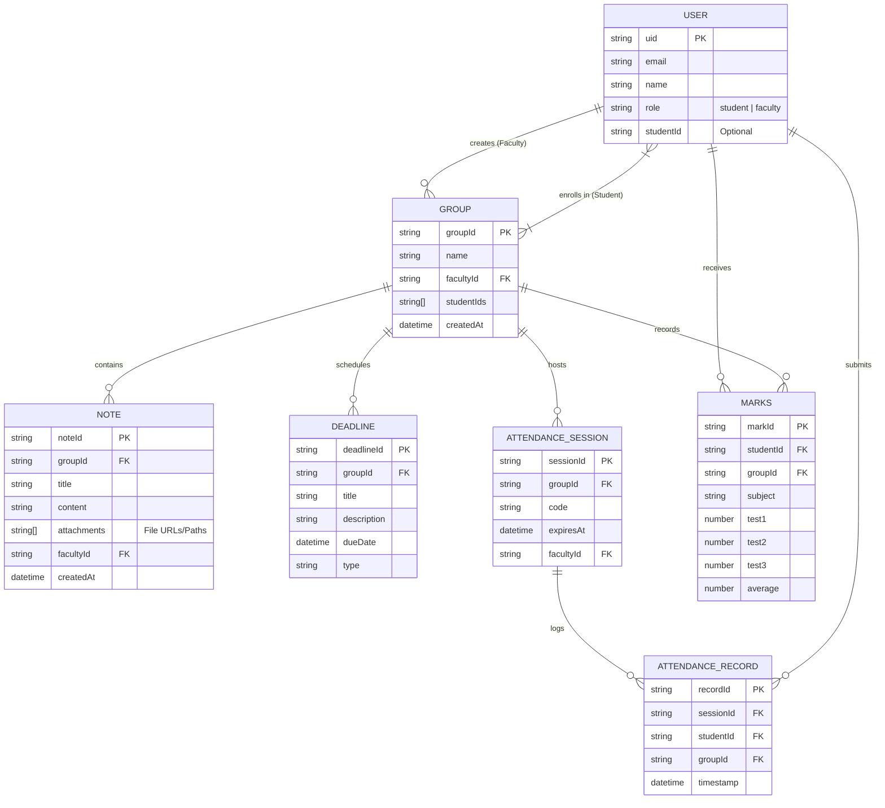

# Entity Relationship Diagram (ERD)

The following diagram represents the data model for the **In-Class Student Companion App**.

## Entity Descriptions

1.  **USER**: Represents both Students and Faculty. Distinguished by the `role` field.
2.  **GROUP**: Represents a Class or Subject (e.g., "CS101 - Intro to CS"). Created by Faculty, contains Students.
3.  **NOTE**: Educational material posted by Faculty in a Group. Can contain file attachments.
4.  **DEADLINE**: Assignments or Experiments with a due date.
5.  **ATTENDANCE_SESSION**: A temporary window (e.g., 5 minutes) created by Faculty where a specific `code` is active.
6.  **ATTENDANCE_RECORD**: A log created when a Student successfully enters the code for a Session.
7.  **MARKS**: Stores internal assessment scores for a Student in a specific Group/Subject.

## Cardinality and Relationships

*   **USER (Faculty) `1 : N` GROUP**: A single faculty member can create and manage multiple groups (classes), but each group is created by exactly one faculty member.
*   **USER (Student) `M : N` GROUP**: A student can enroll in multiple groups, and each group can contain multiple students. *(Note: In Firestore, this is modeled using an array of `studentIds` inside the Group document).*
*   **GROUP `1 : N` NOTE**: A group can contain multiple notes or announcements, but a specific note belongs to exactly one group.
*   **GROUP `1 : N` DEADLINE**: A group can have multiple scheduled deadlines (assignments/exams), but each deadline belongs to exactly one group.
*   **GROUP `1 : N` ATTENDANCE_SESSION**: A group can host multiple attendance sessions over the semester, but each session is tied to exactly one group.
*   **ATTENDANCE_SESSION `1 : N` ATTENDANCE_RECORD**: A single attendance session will log multiple attendance records (one for each present student), but a single record belongs to exactly one session.
*   **USER (Student) `1 : N` ATTENDANCE_RECORD**: A student can submit multiple attendance records over time across different sessions, but each record belongs to exactly one student.
*   **USER (Student) `1 : N` MARKS**: A student can receive multiple mark records (for different groups/subjects), but a specific mark record belongs to exactly one student.
*   **GROUP `1 : N` MARKS**: A group will record multiple marks (one for each student enrolled), but a specific mark record belongs to exactly one group.
